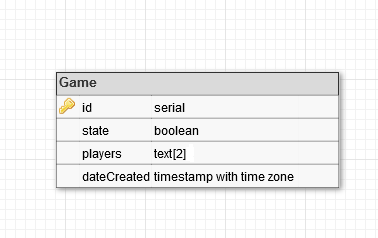

# BabyFoot Manager
## Presentation
BabyFoot Manager is a web application for creating and managing babyfoot games.

## Database model
The database used is a Postgresql database.  


## Eslint
The code was written with the ESLint linter, in its standard configuration, as it's considered as a generic and basic norm, used by lots of developers.

## Docker
The entire application, as well as the database run in docker containers.
This choice was made to facilitate the installation of the database, and to ensure that the application behavior will not depends of your operating system.   
Docker-compose is also used, to ease the application deployment.  
To install Docker, go on https://docs.docker.com/install/. 

## Running the application
To run the application, first, you have to install dependencies first with the following command:
```sh
npm install
```
Then, to launch the database and the application, just type this command:
```sh
docker-compose up
```
While the application is running, you can start using the babyfoot manager by browsing to
```
127.0.0.1:8089
```

## Testing
in progress
